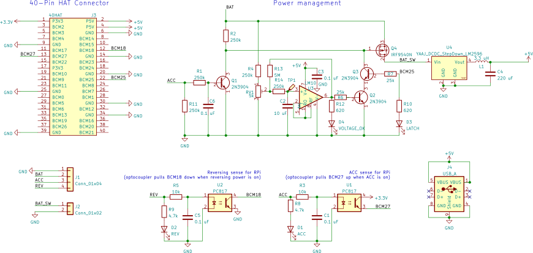

# RPiCarPowerHAT
Automotive power management HAT for Raspberry Pi

The RPiCarPowerHAT is power management circuit for the Raspberry Pi in the form of a HAT. It is designed to to power a Raspberry Pi from 12 V available in a car. It uses a buck converter as a power supply and includes a power management circuit that powers the RPi by the car's permanent power (BAT), but can be switched by the car's accessory power (ACC) and subsequently latched by a GPIO pin from the RPi (inspired by [CarPiHat](https://github.com/gecko242/CarPiHat)). Hence, the RPi can be turned on using the car's ignition switch and latched on by the RPi itself so its power is not cut when the key is removed from the ignition. By releasing the latch, the RPi can then completely power itself down, in a software-defined way (for example, after a configurable time-out after removing the key from the ignition). This way, there is almost zero power draw when the RPi is turned off.

The RPiCarPowerHAT is designed to accept a LM2596 buck converter module, which can be found for less than €1. To alleviate coil whine and ripple, a post ripple filter consisting of an inductor and a capacitor (as recommended in [the datasheet](https://www.ti.com/lit/ds/symlink/lm2596.pdf)) is included in the HAT.

The board includes two opto-isolators for sensing 12 V, e.g. the car's ACC voltage and reversing voltage.

The board is fully THT for easy hand-soldering.

## Features
- Power supply: Uses a LM2596 buck converter module
  - Post ripple filter included
- Smart power management circuit:
  - The RPi is powered by the car's permanent 12 V power (BAT)
  - This is switched by a power MOSFET, which can be turned on by the car's ignition power (ACC) or latched from the RPi itself
  - Low-voltage cut-off to protect the car's battery from deeply discharging in case the RPi fails to release the latch
- 2 opto-isolated GPIO inputs, for e.g. sensing ACC voltage and reversing voltage
- 2 USB-A headers (power only), for e.g. powering a display
- A switched 12 V header for powering peripherals (powered when the RPi is)
- JST header with GND, BAT, ACC, and REV pins
- Status LEDs

## Circuit

## What you need to know
### GPIO pins (BCM numbering):
- Inputs:
  - BCM18 is pulled low when REV is high
  - BCM27 is pulled high wen ACC is high
- Outputs:
  - When BCM25 is pulled high from the RPi, it latches the power management circuit, causing it to stay on even when ACC is low.
  
### Tips
- Set the output voltage of the buck converter to 5.1 V by adjusting its trimpot before connecting the RPi, to prevent damaging the RPi by overvoltage.
- To set the low voltage threshold of the cut-off circuit, adjust trimpot RV1 on the board while measuring the voltage between TP1 and ground such that it reads 0.2 V at the desired threshold supply voltage.
- Do not connect a power supply to the RPi's own micro-USB input while using the power supply on this board.
- This does not fully comply with Raspberry Pi's HAT spec (it doesn't have an ID EEPROM onboard for GPIO autoconfiguration), so this is not an official Raspberry Pi® HAT.

## References

### KiCAD symbols, footprints, and models:

- [RPI_Hat_Template](https://github.com/devbisme/RPi_Hat_Template)
- [LM2596 module](https://grabcad.com/library/lm2596-module-for-kicad-1)
- [Stacked USB-A header](https://octopart.com/61400826021-w%C3%BCrth+elektronik-8917796)
